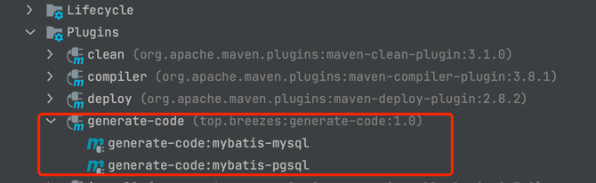

# Generate-Code

#### 1. 介绍

利用Maven提供插件能力，实现代码生成器，减少大部分重复工作量。

#### 2. 插件要求

插件是在`JDK8`下开发，`Maven API`版本在3.5.2,没有测试低版本`JDK`是否兼容。


#### 3. 快速使用

- step1：
  在pom.xml中加入插件配置，详细配置如下：
```xml
          <plugin>
                <groupId>top.breezes</groupId>
                <artifactId>generate-code</artifactId>
                <version>1.0</version>
                <configuration>
                    <!--扫描器配置-->
                    <scanner>
                        <!--全局包扫描-->
                        <basePackage>top.breezes.bean</basePackage>
                        <!--点对点扫描-->
                        <beans>
                            <bean>top.breezes.bean1.Hello1</bean>
                            <bean>top.breezes.bean1.Hello2</bean>
                            <bean>top.breezes.bean1.Hello3</bean>
                        </beans>
                    </scanner>
                    <!--模板配置-->
                    <template>
                        <global>
                            <!--java doc-->
                            <doc>
                                <author>yuchengxin</author>
                                <email>breezes_y@163.com</email>
                                <description></description>
                                <version>1.0</version>
                            </doc>
                        </global>
                        <normal>
                            <!--业务层配置-->
                            <service>
                                <!--是否需要生成-->
                                <generate>true</generate>
                                <!--是否需要接口-->
                                <needInterface>true</needInterface>
                                <packages>top.breezes.service</packages>
                            </service>
                            <!--持久层配置-->
                            <dao>
                                <!--是否需要生成-->
                                <generate>true</generate>
                                <!--代码包配置-->
                                <packages>top.breezes.mapper</packages>
                            </dao>
                        </normal>
                    </template>
                    <!--输出配置-->
                    <output>
                        <!--代码输出根目录-->
                        <baseDir>/Users/yuchengxin/Desktop/generate-code</baseDir>
                    </output>
                </configuration>
            </plugin>
        </plugins>
```

- step2：
  在IDEA等工具中，找到右侧Maven工具栏中的插件双击
  
  
  或者执行
  ```shell
  mvn generate-code:mybatis-mysql
  ```
  ```shell
  mvn generate-code:mybatis-pgsql
  ```